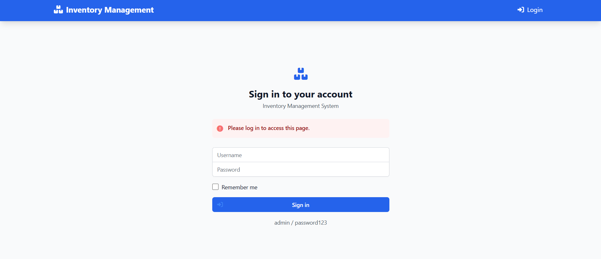
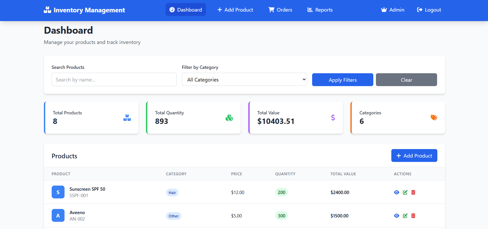
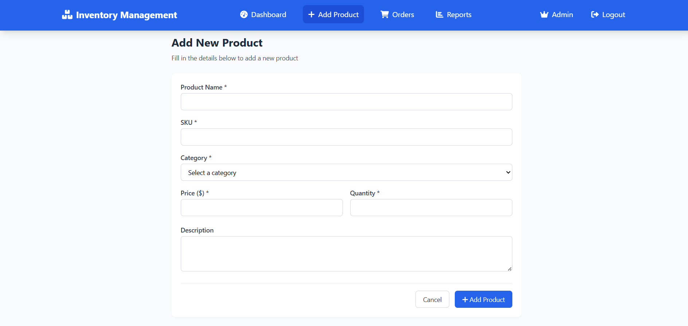
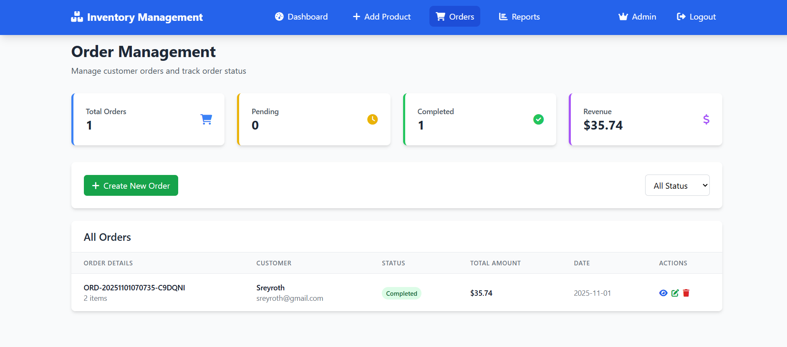
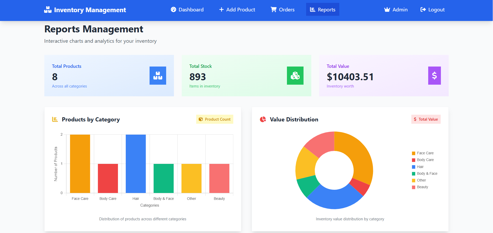
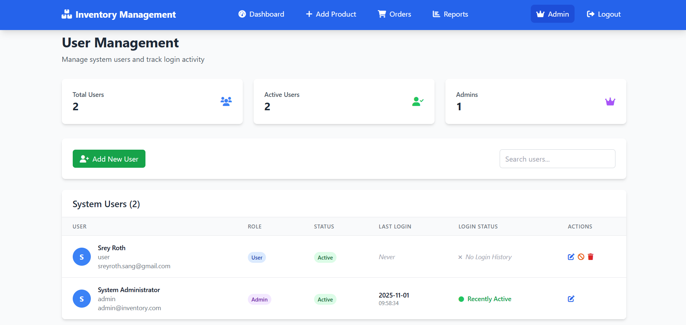

# Inventory Management System 
An Inventory Management System is was built to help businesses track products, manage stock levels, generate reports efficiently, and help to manages users also.

## Features
<!-- - Add, update, order, login, logout, search, view and remove products
- Track stock levels -->
- Login, Logout
- Add, update, view, and remove products
- Order products
- Search and filter products
- Track stock levels
- Reports (total, sales, stock, prices)
- User management

##  Technologies use
- **Frontend:** Python, HTM, JavaScript, Tailwind CSS, Chart.js, Font Awesome 
- **Backend:** Python, Flask, Jinja2, REST API
- **Database:** SQLite, SQLAlchemy
- **Libraries/Modules:**  Flask-SQLAlchemy, JSON

## Installation / Setup
1. Clone the repository: https://github.com/sreyroth1/inventory_management_system.git
2. Install dependencies: `pip install -r requirements.txt`
3.  Run the application: `app.py`
4. Open your browser and navigate to: ` http://127.0.0.1:5000`

## Usage
- Login using the default admin account:
  - Username: admin
  - Password: admin123
- After logging in, users can access the full dashboard where users can manage products, orders, stock, reports also.

## Screenshot
### Login/logout

### Dashboard 

### Add Product

### Orders

### Reports

### User management

## Support

GitHub: [sreyroth1](https://github.com/sreyroth1)  
Email: sreyrothsang925@gmail.com 

## About

This project is currently at version 1.0. It’s designed with simplicity in mind to help small to medium‑sized businesses manage their inventory in a user‑friendly manner.